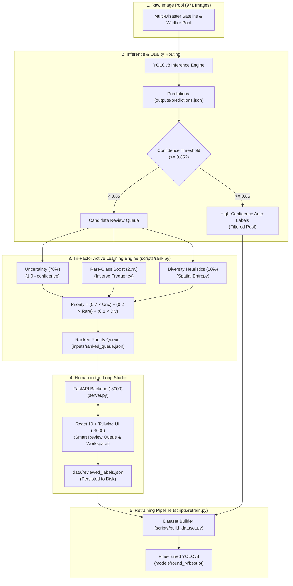

# 🛰️ LabelLess AI: Intelligent Active Learning for Object Detection

> **Intelligent Human-in-the-Loop Annotation for Disaster & Wildfire Computer Vision.**  
> Prioritizing high-leverage samples and filtering redundant detections using Tri-Factor Priority Ranking ($0.7 \times \text{Uncertainty} + 0.2 \times \text{Rarity} + 0.1 \times \text{Diversity}$).

[](https://github.com/Label-Less/Labelless-AI/actions/workflows/ci.yml)
[](https://fastapi.tiangolo.com)
[](https://ultralytics.com)
[](https://react.dev)
[](https://www.typescriptlang.org)

---

## 🎯 The Problem

In time-critical disaster response and wildfire monitoring, teams are flooded with thousands of raw satellite and aerial images. Manually annotating every image is too slow and repetitive:

- **Redundant Easy Samples**: Many images contain obvious, unambiguous patterns where human review adds zero marginal learning signal.
- **Class Imbalance & Rare Objects**: Some damage classes are predicted far less often than others (in the 971-image pool, *Damaged Building* is the least frequent prediction). Naive random sampling or confidence-only sampling can starve these classes, so the ranking adds an inverse-frequency rarity term.
- **The Solution**: An active learning pipeline that routes clear cases ($\ge 85\%$ confidence) into an auto-label pool, and ranks remaining images using a **Tri-Factor formula** that balances uncertainty, rare-class representation, and spatial diversity.

---

## 🏗️ System Architecture



---

## 🔬 Empirical Baseline & Evaluation Protocol

### 1. Cold Start Baseline (Measured)
The cold start model was fine-tuned on the seed partition using YOLOv8n and evaluated against the test split (`results/metrics/round_0_seed.json`):

| Metric | Measured Value |
| :--- | :---: |
| **mAP@50 (Overall)** | **60.89%** ($0.6089$) |
| **mAP@50-95** | **35.88%** ($0.3588$) |
| **Precision** | **61.38%** |
| **Recall** | **61.90%** |
| **F1 Score** | **61.64%** |
| **Undamaged Building AP@50** | 67.16% |
| **Damaged Building AP@50** | 50.58% |
| **Fire AP@50** | 53.60% |
| **Smoke AP@50** | 72.21% |

*Source file*: [`results/metrics/round_0_seed.json`](file:///c:/Users/soham/OneDrive/Documents/Label-Less/Labelless-AI/results/metrics/round_0_seed.json)

---

### 2. Active Learning Experiment Protocol
The project includes a fully automated experiment runner (`scripts/run_experiment.py`) designed to benchmark subsequent active learning rounds across:
- **Random Sampling**: Standard uniform candidate selection baseline.
- **Confidence-Only Sampling**: Lowest-confidence uncertainty selection.
- **LabelLess AI Composite**: Tri-factor priority selection ($0.7 \times \text{Uncertainty} + 0.2 \times \text{Rarity} + 0.1 \times \text{Diversity}$).

Each round executes: `select candidates → collect human reviews → build YOLO dataset → fine-tune YOLOv8 → evaluate on test split → save metrics JSON`.

All metrics published in this project are strictly parsed from JSON files in `results/metrics/`. Unverified multi-round trajectories are excluded until full GPU training passes are committed.

---

## ⚡ Quickstart (One-Command Reproduction)

### 1. Prerequisites
- Python 3.10+
- Node.js 18+

### 2. Clone & Install
```bash
git clone https://github.com/Label-Less/Labelless-AI.git
cd Labelless-AI

# Install Python dependencies
pip install -r requirements.txt

# Install Node dependencies
npm install
```

### 3. Launch Development Environment
```bash
# Windows
start_dev.bat

# Linux / macOS
chmod +x start_dev.sh
./start_dev.sh
```

- **React Human Review Studio**: [http://localhost:3000](http://localhost:3000)
- **FastAPI Interactive API Docs**: [http://localhost:8000/docs](http://localhost:8000/docs)

### 4. Run Pipeline Sync Headless
```bash
python run_pipeline.py
```

### 5. Automated Tests
```bash
# Backend Pytest Suite (16/16 tests passing)
pytest tests/ -v

# Frontend TypeScript Typecheck
npm run lint

# Production Vite Build
npm run build
```

---

## 📡 REST API Reference

| Endpoint | Method | Description |
| :--- | :---: | :--- |
| `/api/health` | `GET` | Health check and uptime status |
| `/api/config` | `GET` | Returns canonical pipeline config (weights, thresholds, classes) |
| `/api/queue` | `GET` | Returns prioritized ranked queue with uncertainty scores |
| `/api/label` | `POST` | Persists human review / bounding box annotations to disk |
| `/api/round/next` | `POST` | Merges human labels + pseudo-labels for round progression |
| `/api/metrics` | `GET` | Returns multi-round evolution metrics and benchmark curves |

---

## 📄 Dataset & Licensing

- **Dataset Sources**:
  1. **Wildfire & Smoke Aerial Imagery**: Roboflow Universe Wildfire/Smoke Dataset (CC BY 4.0).
  2. **Satellite Building Damage**: Satellite disaster imagery subset (4 classes: `undamagedbuilding`, `damagedbuilding`, `fire`, `smoke`).
- **Code License**: MIT License.
